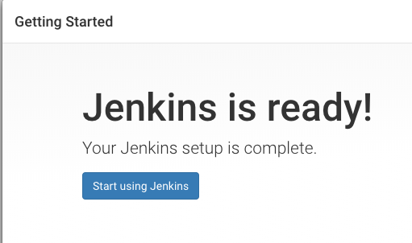

Após a finalização da criação do ambiente acessar a URL https://192.168.56.110


<i>O Jenkins está configurado para permitir acesso através de um servidor de proxy [nginx](https://www.nginx.com/). Os certificados são auto assinados e por este motivo o navegador não reconhece a entidade autorizadora.</i>

### 3. Prossiga clicando em <b>Avançado</b>


### 4. Clique em <b>Ir para 192.168.56.110 (não seguro)</b>
### 5. Recupere a senha definida inicialmente durante a instalação. Existem duas maneiras de recuperar esta senha inicial:
  - No diretório raiz da execução do ansible na pasta buffer ler o conteúdo do arquivo jenkins-master-initialAdminPassword `cat buffer/jenkins-master-initialAdminPassword`

  - Recuperar diretamente do jenkins-master
```
ssh root@192.168.56.110 cat /var/lib/jenkins/secrets/initialAdminPassword
```
O retorno deve ser um valor como: <b>da4f06f440e04cf7935a670cb9635759</b> utilize este valor no campo Administrator password.

### 6. Prossiga clicando em Continue

### 7. Clique em <b>Install suggested plugins</b>

Aguarde a instalação finalizar para prosseguir

### 8. Preencha o formulário acima com informações relativas ao primeiro usuário a ser criado. <i>Este usuário terá privilégios administrativos</i>
### 9. Clique em <b>Save and Continue</b>

### 10. Informe o valor `https://192.168.56.110` no campo <b>Jenkins URL</b>
### 11. Cliquem em <b>Save and Finish</b>

### 12. Clique em <b>Start using Jenkins</b>


  - *Em alguns casos o navegador o navegador pode guardar um cache da URL e a tela pode "congelar". Caso isto ocorra digite na URL https://192.168.56.110/login?from=%2F*
  - *Pode haver situação que após a configuração do primeiro usuário o Jenkins entre em loop e não permita o login. Para contornar este BUG execute o reinicio do jenkins.*
  ```
  ssh root@192.168.56.110 systemctl restart jenkins
  ```

### 13. Informe o usuário e senha criados no passo 8

### 14. Após o login clique em **Gerenciar Jenkins**

### 15. Clique em **Gerenciar plugins**

### 16. Clique na aba **Disponíveis**
  - No campo **Filtrar** digite `configuration as code`
  - Selecione o plugin **Configuration as Code**
  - Clique em **Instalar sem reiniciar**

### 17. Após a instalação finalizada com sucesso clique em **Gerenciar Jenkins**

### 18. Clique em **Configuration as Code**

### 19. Informe o valor `file:////opt/jenkins.yaml` no campo **Path or URL**
  - Clique em **Apply new configuration**
  - Aguarde a finalização da instalação
  - Se desejar é possível acompanhar os logs no servidor realizando os seguintes passos:
    ```
    ssh root@192.168.56.110 tail -f /var/log/jenkins/jenkins.log
    ```
      *ctrl + c para interromper*
  - Se durante a instalação uma janela similar abaixo aparecer  clique no link **Jenkins** no canto superior esquerdo. Em seguida clique em **Gerenciar Jenkins**
  - Se a página "congelar" no carregamento por um período superior a 5 minutos pode significar que o plugin congelou o servidor. Para sanar este problema siga os passos abaixo:
    - Clique no canto superior esquerdo no Logo do Jenkins
    - Acesse **Gerenciar Jenkins**
    - Em seguida acessa **Gerenciar Plugins**
    - Clique na aba **Disponíveis**
    - No campo **Filtrar** digite `Blue ocean`
    - Na lista que aparecerá selecione o plugin *Blue Ocean*
    - No canto inferior da tela clique em **Baixar agora, instalar e depois reiniciar**
    - Certifique-se de marcar o checkbox para que o Jenkins reinicie tão logo finalize a instalação dos plugins.
### 20. Reinicie o Jenkins para finalizar a atualização e implantação das novas configurações.
```
ssh root@192.168.56.110 systemctl restart jenkins
```
