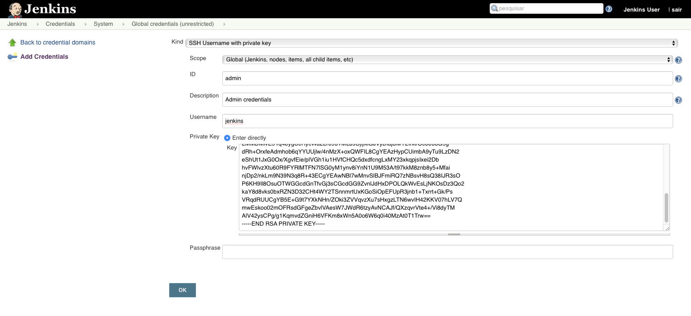
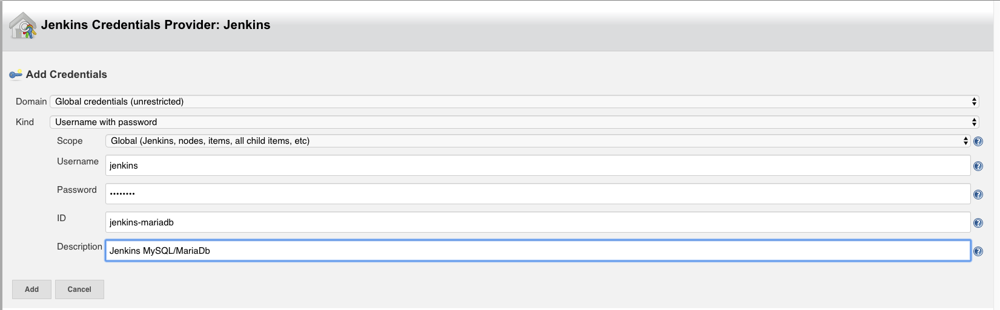
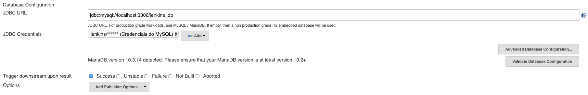

### Inserindo novos nós no jenkins

## Inserindo nós através do playbook ansible.
Alguns dos passos abaixo podem ser automatizados através do uso do playbook *playbook-nodes.yml* na pasta ansible.</br>
**Usando o método de inclusão através do playbook siga diretamente para o passo 33**

Primeiramente é necessário gerar uma credencial administrativa para acessar os nodes remotos.
- Na página inicial do Jenkins clique em **Credentials &rarr; Domains &rarr; (global)**
- Clique em **Add Credentials**
- Preencha conforme exemplo abaixo
<br/>
  - **Kind:** SSH Username with private key
  - **ID:** admin
  - **Description:** Admin credentials
  - **Username:** jenkins
  - **Private Key:** selecionar *Enter directly*
  - **Key:** No campo key copie e cole com o conteúdo do seguinte comando:</br>
  ```
  cd ansible
  cat buffer/rj-jenkins-master-id_rsa
  ```
  - Clique em **OK/Salvar**

Edite o arquivo ansible/playbook-nodes.yml
Verifique e valide a configuração dos nodes nas linhas abaixo:
```yaml
- name: Install new nodes
  shell: "/opt/jenkins-create-node.sh {{ item.name }} {{ item.ip }}"
  with_items:
    - { name: 'rj-jenkins-node1', ip: '10.1.123.209' }
    - { name: 'rj-jenkins-node2', ip: '10.1.123.210' }
  when: inventory_hostname in groups['master']
```
**Complete com as informações dos nodes que serão slaves**

Após editar o playbook execute-o com o comando abaixo:
```
cd ansible
ansible-playbook -i hosts-vmware playbook-nodes.yml -vv
```

Acesse os nodes e observe os rótulos/labels.

**Caso uma mensagem aparece no menu Gerenciar Jenkins sobre dados antigos pode clicar em administrar e remover dados antigos. É um bug no jenkins que não consegue identificar os nodes XML como válidos. Após a remoção garanta que os nodes continuam ativos e os rótulos _build_ e _maven_ continuam existindo. Para consultar navegue até Gerenciar Jenkins &rarr; Gerenciar nós. Se não constarem nos nodes inclua-os manualmente antes de prosseguir**<br/>

**Siga para o passo [33](#_33-na-lista-de-nós-clique-no-master)**

## Inserindo nós manualmente
<br/>
### 21. Clique novamente **Gerenciar Jenkins**

### 22. Clique em **Gerenciar nós***

### 23. Clique em **Novo nó**

### 24. Informe o nome do nó no campo **Nome do nó**
  - selecione **Permanent Agent**
  - clique **OK**

### 25. Preencha o formulário com as informações abaixo:
  - **Nome** jenkins-node1
  - **Descrição** Maven Jenkins Node 1
  - **Número de executores** 2
  - **Diretório remoto** /home/jenkins
  - **Rótulos** maven node1
  - **Uso** Use this node as much as possible
  - **Método de lançamento** Launch agent agents via SSH
    - **_Host_** 10.1.124.129
    - **_Host Key Verification Strategy_** Non verifying Verification Strategy
  - **Disponibilidade** Keep this agent online as much as possible


### 26. Clique em *Metodo de lançamento* -> *Credentials* -> *Add* -> **_Jenkins_**

### 27. Preencha o formulário conforme abaixo:
  - **Domain** Global credentials (unrestricted)
  - **Kind** SSH Username with private key
  - **Scope** Global...
  - **Username** jenkins
  - Marque o campo **Private Key** -> **_Enter directly_**.
  - Dentro deste campo deve ser informada a chave privada do usuário. Durante a instalação o ansible copiou no diretório buffer o arquivo jenkins-master-id_rsa.
  - copie o conteúdo do arquivo para o campo **Key** `cat buffer/jenkins-master-id_rsa`
  - clique em **Add**


### 28. De volta a janela anterior selecione a credential criada.
### 29. Clique em **Salvar**

### 30. Selecione o novo nó criado clicando sobre **jenkins-node1**
  - Se o jenkins não realizar a conexão com o servidor clique no botão **Relaunch agent** para estabelecer a conexão entre o master e o node.
### 31. Repetir os passos [21-30] para inserir o nó *jenkins-node2*
  - Alterar referências de nomes de node1 para node2. Onde se lê jenkins-node1 deve ser alterado para jenkins-node2.
  - Utilizar o ip do Host 10.1.124.130
  - Credenciais utilizar jenkins


### 32. Clique no link **jenkins-node2**
Caso seja necessário clique em **Relaunch agent**

### 33. Na lista de Nós clique no **master**

### 34. Clique em **Configurar**

### 35. Preencha o formulário com as seguintes informações:
  - **Número de executores** 0
  - **Rótulos** master
  - **Uso** Deixar o processamento para jobs vinculadas
  - clique em **Salvar**

### Configurações Globais


### Clique em **Gerenciar Jenkins &rarr; Global Tool Configuration**

Na sessão **Pipeline Maven Configuration**
- Em JDBC URL informe `jdbc:mysql://localhost:3306/jenkins_db`
- Em JDBC Credentials
  - Clique em Add &rarr; Jenkins

</br>
Preencha o formulário com os dados abaixo:
- Domain: _Global..._
- Kind: _Username with password_
- Scope: _Global..._
- Username: _jenkins_
- Password: _password_
- ID: _jenkins-mariadb_
- Description: _Jenkins MariaDB_
- Clique em **Add**

Retornando a tela **Global Tool Configuration**
- Selecione em JDBC Credentials _`jenkins/***** (Jenkins MariaDB)`_ _(A credencial criada conforme acima)_
- Clique em **Validate Database Configuration**
</br>


### Na sessão JDK clique em **Adicionar JDK***


### Configure conforme abaixo:
  - desmarque o campo **Instalar automaticamente**
  - no campo **Nome** informe `JDK_1.8`
  - no campo **JAVA_HOME** informe `/usr/lib/jvm/java-1.8.0-openjdk/`
  - 


### Navegue até a sessão do Maven e clique em **Adicionar Maven**


### Configure conforme abaixo:
 - desmarque o campo **Instalar automaticamente**
 - no campo **Nome** informe `M3`
 - no campo **MAVEN_HOME** informe `/opt/apache-maven-3.5.4`


### Clique em **Save**
