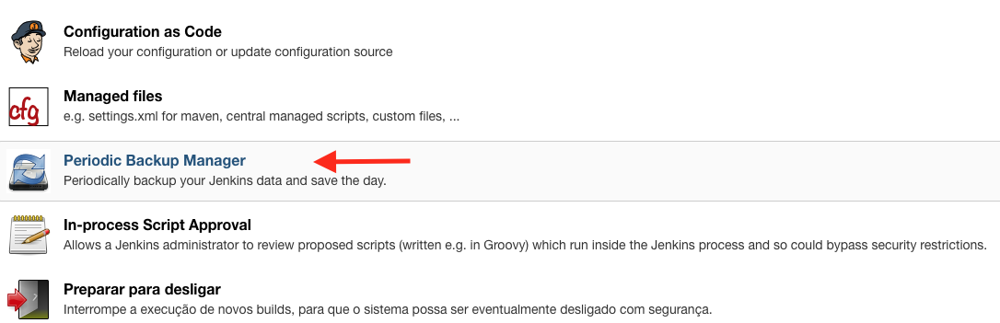

### Configurando Backup periódico

- Acesse **Gerenciar Jenkins &rarr; Periodic Backup Manager**
- Clique em **Click here to configure it**

- Preencha o formulário com os dados conforme figura acima.
  - **Temporary Directory:** _/tmp/jenkins_
  - **Backup schedule (cron):** `0 0 * * *` _(Agenda backup para execuções diárias a partir da 00:00)_
  - Pressione **Validate cron syntax** para validar a expressão CRON
  - **Maximum Backups in location:** _3_
  - **Store no older than (days):** _5_
  - **File Management Strategy:** _ConfigOnly_
  - **Storage Strategy:** Clique em **Add Storage &rarr;** _TarGzStorage_
  - **Backup Location &rarr; LocalDirectory &rarr; Backup directory path &rarr;** _/mnt/backups_ (Este caminho é montado via NFS para garantir a replicação do arquivo bem como centralizar numa unidade de storage mais segura)
  - Clique em **Save**
